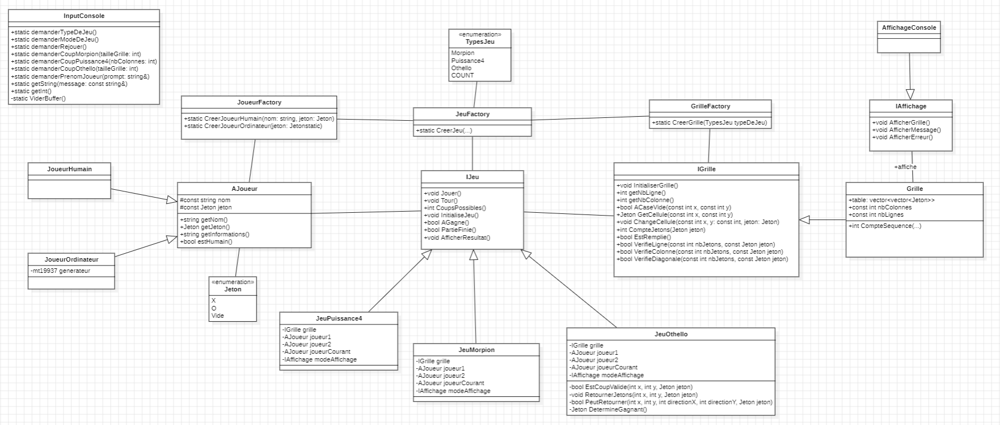

    <h1>TP5 Ajout du jeu Othello ⚪⚫</h1>
    

# :notebook_with_decorative_cover: Summary

[[_TOC_]]

# Anciens codes

## Projet A : Vlad - Nico ([lien du projet](https://gitlab.com/cnam420539/CPP/-/tree/main/TP03?ref_type=heads))

### Points d'amélioration identifiés

- Éviter les "nombres magiques" (utilisation de valeurs arbitraires) dans les conditions, par exemple sur la ligne 4 : privilégier l'utilisation d'une constante comme `NbJetonsGagnants` au lieu du nombre "4".
- Dans une classe, maintenir une organisation constante en suivant l'ordre : Public, Protected, Private.
- Utiliser des pointeurs logiques ou les shares pointeurs plutôt que des pointeurs C.
- Réviser la répartition des responsabilités, par exemple, la classe `CreateGame` a actuellement trois responsabilités distinctes (Grilles, Joueurs, Jeu) ; il est préférable de les séparer.
- Éviter les conditions telles que `if -1` ; préférer l'utilisation d'un booléen.
- La partie publique de l'interface `Grille` ne doit pas être manipulée (exception utilisateur).
- Les interfaces/affichage/règles du jeu ne doivent pas dépendre des grilles.
- Clarifier le rôle de la classe `Grille` qui détermine les lignes et les états des lignes (alignement des pions) ; c'est cette classe qui sait où le joueur peut placer les pions.
- Rendre la méthode `ChooseGame` statique plutôt que dynamique.
- Assurer que le choix du jeu ne communique pas avec l'utilisateur et n'effectue pas d'affichage, car ces sont deux responsabilités distinctes.

### Autres observations

- Veiller à la validation exhaustive des inputs de l'utilisateur, en mettant en place des méthodes définissant les limites, par exemple, conversion entre int et char.
- Accroître la fréquence des commits pour Nicolas.
- Porter une attention particulière au nommage, notamment en ce qui concerne l'alignement vertical.
- Considérer la suppression de l'énumération `Symbole` si elle ne présente pas d'utilité manifeste.

## Projet B : Alizée - Winness ([lien du projet](https://gitlab.com/WRKT1/td-cpp-winness-rakoto/-/tree/main/TP3-Refacto?ref_type=heads))

### Points d'amélioration identifiés

- Les vérifications dans les jeux sont retirées et intégrées dans la classe `Grille`.
- La fonction `PlacerJeton()` est retirée des jeux et réintégrée dans la classe `Grille`.
- La factory pour le joueur est éliminée (supprimée).
- Une interface dédiée à l'affichage des jeux est créée.
- Une interface pour les entrées console des utilisateurs réels est mise en place.
- Davantage de constantes sont ajoutées aux classes.
- La pratique d'utiliser `override` de manière non justifiée est abandonnée.
- La notion de "Ligne disponible" est synonyme de "Case disponible", et ces termes sont uniformément utilisés.

# Le projet retenu :

- Alizée - Winness ([lien du projet](https://gitlab.com/WRKT1/td-cpp-winness-rakoto/-/tree/main/TP3-Refacto?ref_type=heads))

## Analyse Comparative des Projets

À la suite de la réunion tenue le 24 novembre 2023, durant laquelle une évaluation exhaustive des projets de Vlad - Nicolas et d'Alizée - Winness a été conduite, une conclusion évidente en faveur du choix du projet Alizée - Winness a émergé.

Cette décision est principalement basée sur les commentaires détaillés que nous avons reçus lors de la première vérification du code du projet. Ces retours ont souligné la nécessité de simplifier et de clarifier le code en effectuant des modifications, afin de rendre le projet plus solide à long terme en suivant les principes SOLID.

## Complexité des adaptatations requises

L'inventaire des adaptations nécessaires pour le projet Alizée - Winness révèle moins de complexités pour l'implémentation du jeu Othello. Cette simplicité offre une solution plus rapide et efficiente pour l'amélioration du code existant.

## Flexibilité face aux évolutions futures

En comparaison, le projet Alizée - Winness se distingue par son approche qui facilite l'intégration du nouveau jeu Othello. Cette caractéristique démontre la souplesse inhérente au projet et son aptitude à s'adapter aisément aux exigences évolutives.

## Absence d'anomalies constaté

De surcroît, le projet Alizée - Winness se démarque par l'absence de soucis présentes dans le projet de Vlad - Nicolas. Des lacunes telles que l'utilisation de nombres magiques et des erreurs de conception, comme la dépendance entre Interface/affichage/Regles du jeu et Grilles, sont écartées dans le projet retenu.

La sélection du projet Alizée - Winness repose sur une évaluation rigoureuse des retours issus de la revue de code, la simplicité des adaptations requises, la capacité à s'ajuster aux évolutions futures, ainsi que l'éradication des anomalies constatées dans le projet concurrent. Ces éléments renforcent la position d'Alizée - Winness en tant que choix optimal pour la poursuite du développement.

# Modifications apportées au projet

## Ajout du jeu Othello

Le jeu Othello est ajouté au projet, en suivant les principes SOLID. Les classes sont réorganisées pour respecter les principes de responsabilité unique et d'ouverture/fermeture. Les classes sont également renommées pour refléter leur rôle dans le projet.

## Ajout de l'interface `IAffichage`

Une interface `IAffichage` est ajoutée pour gérer l'affichage des messages et des grilles. Cette interface est implémentée par la classe `AffichageConsole`. Cette modification permet de séparer les responsabilités de l'affichage et des grilles.

## Ajout de la classe `InputConsole`

Une classe `InputConsole` est ajoutée pour gérer les entrées de l'utilisateur. Cette classe est utilisée par la classe `Jeu` pour récupérer les entrées de l'utilisateur. Cette modification permet de séparer les responsabilités de l'affichage et des grilles.

## Modification de la classe `Grille`

La classe `Grille` est modifiée pour gérer les grilles de jeu. Cette classe est utilisée par la classe `Jeu` pour gérer les grilles de jeu. Cette modification permet de séparer les responsabilités et de supprimer la dépendance entre les interfaces/affichage/règles du jeu et les grilles.

## Clarification des méthodes

Les methodes de validations de Ligne, colonne et diagonale affectée à grille sont déplacées dans la classe `Grille`. Cette modification permet de séparer les responsabilités et de supprimer la dépendance entre les interfaces/affichage/règles du jeu et les grilles.

## Test unitaire

Un test unitaire est ajouté pour tester la classe du jeu Othello. Ce test permet de vérifier le bon fonctionnement du jeu en testant les méthodes de la classe `JeuOthello`.

# Diagramme UML

# Conclusion

Les modifications apportées au projet permettent de respecter les principes SOLID et de séparer les responsabilités comme cela nous a été recommandé lors de la revue de code. Suite à ces changements facilitent l'ajout de nouveaux jeux et l'évolution du projet.

# Contributeurs

- **Winness RAKOTOZAFY** _alias_ [@WRKT1](https://gitlab.com/WRKT1)
- **Alizée HETT** _alias_ [@Dinholu](https://gitlab.com/Dinholu)
- **Vladimir SACCHETTO** _alias_ [@Vladimir9595](https://gitlab.com/Vladimir9595)
- **Nicolas REMY** _alias_ [@NicolasRemy](https://gitlab.com/CFAI-REMY-NICOLAS)

    <b><a href="#readme-top">↥ Back To Top</a></b>

<!-- 
(<a href="#readme-top">back to top</a>)
 -->
